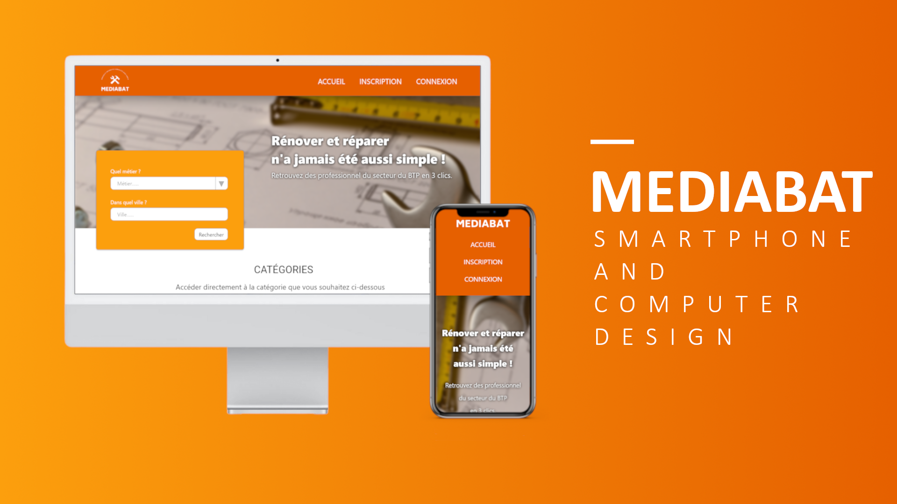

# MEDIABAT

### STACK:
   

This project is a social network for independent construction workers.

They will be able to :
- Publish images of the work they did
- Receive and send messages
- Receive a rating on 5 stars
- Report a user

The standard user will be able to :
- Send and receive messages
- Rate a user on 5 stars

TODO :
- User Manager & Controller
- Publication Manager & Controller
- Router
- Fix PATHS

- Messaging system
- Report user system
- Rating system
- Admin system